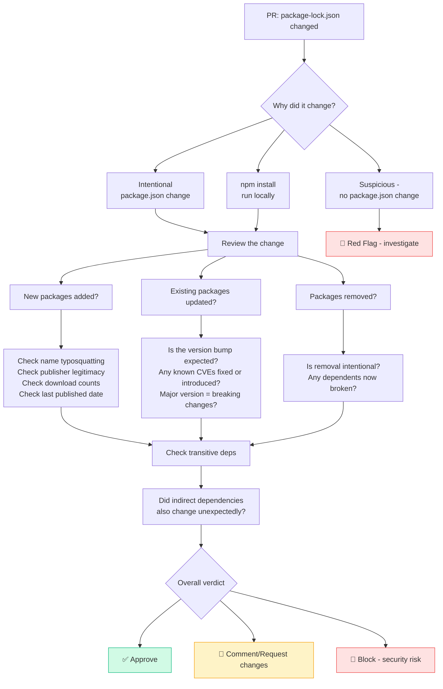

# Reviewing dependency changes at Caracal Lynx

> Reference guide for colleagues reviewing PRs that include `package-lock.json` or `package.json` changes.
> The reviewer checklist is embedded in every dependency PR template — this doc explains the *why* behind each check.

---

## Why dependency reviews matter

`package-lock.json` locks the exact version of every package (direct and transitive) in the project.
A careless or malicious change here can introduce:

- **Security vulnerabilities** — a new CVE in an updated package
- **Supply chain attacks** — a typosquatted or compromised package
- **Breaking changes** — a major version bump that subtly breaks behaviour
- **Build instability** — an unintentional lock file regeneration that silently updates dozens of packages

It looks like boring JSON. It isn't. 🙂

---

## Quick reference

| File | Written by | Purpose | Edit manually? |
|------|-----------|---------|---------------|
| `package.json` | You | Declare intent (`^1.2.0`) | ✅ Yes |
| `package-lock.json` | npm | Lock exact versions (`1.2.7`) | 🚫 Never |

---

## Review flow



---

## Check 1 — Does the change make sense?

- Does `package.json` **also** change? If not — why did the lock file change?
- Was `npm install` run unnecessarily, causing a mass version shuffle?
- Is this a targeted update or a full regeneration?

> 🚨 **Red flag:** Lock file changes with no corresponding `package.json` change need a clear explanation.

---

## Check 2 — New packages (supply chain threat)

For every newly added package:

- 🎭 **Typosquatting** — `lodahs` instead of `lodash`, `expres` instead of `express`
- 👤 **Publisher legitimacy** — is this a known author/organisation with a track record?
- 📅 **Recently published** — brand new packages with no history are risky
- 🔗 **Resolved URL** — should point to `registry.npmjs.org`, not an unexpected registry

---

## Check 3 — Version changes

| Bump type | Example | Action |
|-----------|---------|--------|
| **Patch** | `1.2.3 → 1.2.4` | Usually fine — likely a bug/security fix |
| **Minor** | `1.2.x → 1.3.x` | Check changelog for anything impactful |
| **Major** | `1.x → 2.x` | 🚨 Breaking changes — needs justification |

---

## Check 4 — Security

```bash
npm audit
```

- Does the change **introduce** a known CVE?
- Does the change **resolve** a known CVE? (Good — but verify it's intentional.)
- Check [https://www.npmjs.com/advisories](https://www.npmjs.com/advisories) for advisories.

---

## Check 5 — Transitive dependencies

- A single `package.json` change can ripple into **dozens** of lock file line changes — this is normal.
- Scan for unexpected new top-level resolved packages that don't trace back to an intentional change.
- Watch for `integrity` hash changes on packages whose version **did not** change.

---

## Check 6 — The `integrity` field 🚨

```json
"integrity": "sha512-abc123..."
```

This is a **cryptographic hash** of the package tarball.

> 🚨 **Block immediately** if a package's version did not change but its `integrity` hash **did**.
> This could indicate a compromised or tampered package.

---

## Check 7 — Lock file format

- `lockfileVersion: 3` is current (npm 7+)
- A downgrade to `1` or `2` may mean someone used an outdated npm version
- Only one lock file format should exist — mixing `package-lock.json`, `yarn.lock`, and `pnpm-lock.yaml` is a problem

---

## Suggested review comments

| Situation | Suggested comment |
|-----------|------------------|
| Unexplained lock change | *"What triggered this lock file change? No `package.json` changes are visible."* |
| New unfamiliar package | *"Can you confirm this package's provenance? This is the first time I've seen it in the codebase."* |
| Major version bump | *"This is a major version bump — has the changelog been reviewed for breaking changes?"* |
| Massive transitive diff | *"This looks like a full `npm install` regeneration — was that intentional, or should this be a targeted update?"* |
| Integrity hash mismatch | *"The integrity hash changed without a version change — this needs investigation before merging."* |

---

## Useful commands

```bash
# Check for known vulnerabilities
npm audit

# Install exactly what's in the lock file (use in CI/CD)
npm ci

# See what changed between two versions of a package
npm diff <pkg>@<old-version> <pkg>@<new-version>

# See what packages are outdated
npx npm-check-updates
```

---

## CI/CD note

Use `npm ci` in pipelines rather than `npm install`:
- Installs **exactly** what's in `package-lock.json`
- Errors if `package.json` and `package-lock.json` are out of sync
- Faster and more deterministic

---

*Caracal Lynx Limited · maintained in `.github/REVIEWING.md`*
