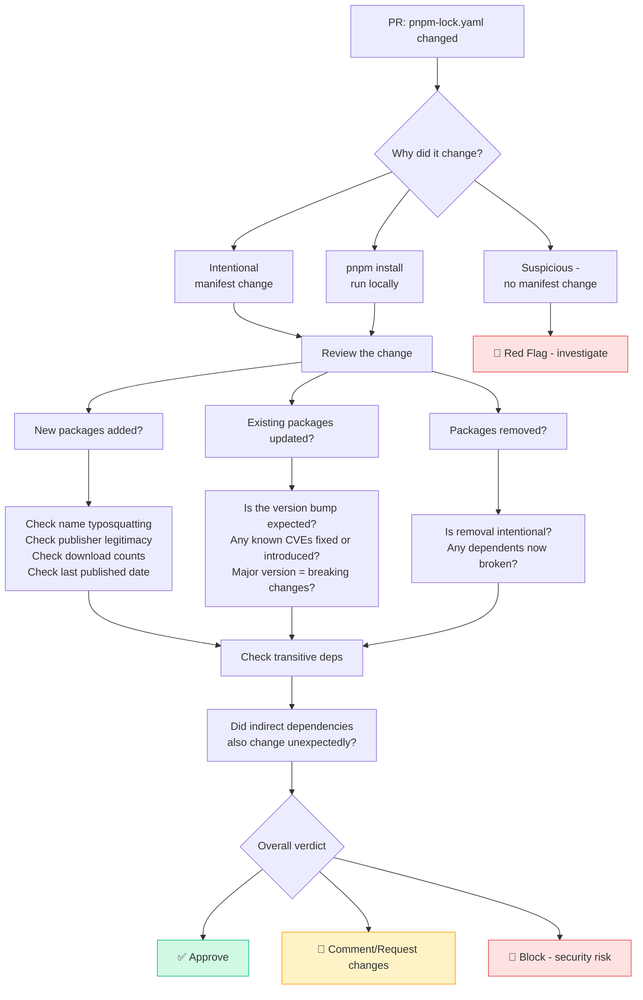

# Reviewing dependency changes at Caracal Lynx

> Reference guide for colleagues reviewing PRs that include `pnpm-lock.yaml`, `package.json` or
> `pnpm-workspace.yaml` changes.
> The reviewer checklist is embedded in every dependency PR template — this doc explains the _why_
> behind each check.

The fleet has been **pnpm-only since June 2026** (DAG-145). If you are looking at a
`package-lock.json`, you are either in a repo nobody has migrated or something is wrong — say so in
review.

---

## Why dependency reviews matter

`pnpm-lock.yaml` locks the exact version of every package (direct and transitive) in the workspace.
A careless or malicious change here can introduce:

- **Security vulnerabilities** — a new CVE in an updated package
- **Supply chain attacks** — a typosquatted or compromised package
- **Breaking changes** — a major version bump that subtly breaks behaviour
- **Build instability** — an unintentional lock file regeneration that silently updates dozens of packages

It looks like boring YAML. It isn't. 🙂

---

## Quick reference

| File | Written by | Purpose | Edit manually? |
| --- | --- | --- | --- |
| `package.json` | You | Declare intent (`^1.2.0`) | ✅ Yes — but see below |
| `pnpm-lock.yaml` | pnpm | Lock exact versions (`1.2.7`) | 🚫 Never |
| `pnpm-workspace.yaml` | You | Workspace globs, `overrides`, `allowBuilds`, `catalog`, `minimumReleaseAge` | ✅ Yes — **and it is security-relevant** |

**Renovate owns version bumps** (`[DEP-01]`). A hand-edited version range in `package.json` is
itself a review finding unless the PR explains why Renovate could not do it — a deliberately
narrowed range to pin a defect is the usual legitimate reason, and it should say so.

---

## Review flow


```mermaid
flowchart TD
    A[PR: pnpm-lock.yaml changed] --> B{Why did it change?}

    B --> C[Intentional\nmanifest change]
    B --> D[pnpm install\nrun locally]
    B --> E[Suspicious -\nno manifest change]

    C --> F[Review the change]
    D --> F
    E --> Z[🚨 Red Flag - investigate]

    F --> G[New packages added?]
    F --> H[Existing packages updated?]
    F --> I[Packages removed?]

    G --> G1[Check name typosquatting\nCheck publisher legitimacy\nCheck download counts\nCheck last published date]
    H --> H1[Is the version bump expected?\nAny known CVEs fixed or introduced?\nMajor version = breaking changes?]
    I --> I1[Is removal intentional?\nAny dependents now broken?]

    G1 --> J[Check transitive deps]
    H1 --> J
    I1 --> J

    J --> J1[Did indirect dependencies\nalso change unexpectedly?]
    J1 --> K{Overall verdict}

    K --> K1[✅ Approve]
    K --> K2[💬 Comment/Request changes]
    K --> K3[🚨 Block - security risk]

    style Z fill:#fee2e2,stroke:#ef4444
    style K1 fill:#d1fae5,stroke:#10b981
    style K2 fill:#fef3c7,stroke:#f59e0b
    style K3 fill:#fee2e2,stroke:#ef4444
```

---

## Check 1 — Does the change make sense?

- Does a manifest **also** change — `package.json`, `pnpm-workspace.yaml`? If not, why did the lock
  file change?
- Was `pnpm install` run unnecessarily, causing a mass version shuffle?
- Is this a targeted update or a full regeneration?

> 🚨 **Red flag:** Lock file changes with no corresponding manifest change need a clear explanation.

**Renovate's `lockFileMaintenance` is the one legitimate exception** — it regenerates the lock file
from the manifests on a schedule, with no manifest diff at all. It is also the mechanism that walks
straight past a Renovate `allowedVersions` ceiling, because that rule governs what Renovate
_offers_, not what pnpm _resolves_. If a lockfile-only PR moves a package that is supposed to be
held, the hold is not binding — a real defect, not a cosmetic one (DAG-301).

---

## Check 2 — New packages (supply chain threat)

For every newly added package:

- 🎭 **Typosquatting** — `lodahs` instead of `lodash`, `expres` instead of `express`
- 👤 **Publisher legitimacy** — is this a known author/organisation with a track record?
- 📅 **Recently published** — brand new packages with no history are risky
- 🔗 **Resolved URL** — should point to `registry.npmjs.org`, not an unexpected registry

`minimumReleaseAge` in `pnpm-workspace.yaml` (4320 minutes — three days) already blocks the freshest
releases, deliberately matching Renovate's own age gate. A PR that **lowers or removes** it is
removing a supply-chain control and needs to justify itself.

---

## Check 3 — Version changes

| Bump type | Example | Action |
| --- | --- | --- |
| **Patch** | `1.2.3 → 1.2.4` | Usually fine — likely a bug/security fix |
| **Minor** | `1.2.x → 1.3.x` | Check changelog for anything impactful |
| **Major** | `1.x → 2.x` | 🚨 Breaking changes — needs justification |

A **prerelease** version deserves a second look. npm's rule is that a prerelease satisfies a range
only when a comparator shares its exact `[major, minor, patch]` tuple, so a caret cannot span them.
`@duckdb/node-api@^1.5.0-r.1` matched exactly one version and froze a package twelve releases behind
for six weeks before anyone noticed (DAG-189).

---

## Check 4 — Security

```powershell
pnpm audit --prod
```

- Does the change **introduce** a known CVE?
- Does the change **resolve** a known CVE? (Good — but verify it's intentional.)
- Check <https://github.com/advisories> for advisories.

`pnpm audit --prod` is a blocking CI job. If a PR touches `overrides` in `pnpm-workspace.yaml`,
re-run it locally: those entries are **hand-managed, not Renovate's**, and dropping one silently
regresses the audit.

---

## Check 5 — Transitive dependencies

- A single `package.json` change can ripple into **dozens** of lock file line changes — this is normal.
- Scan for unexpected new top-level resolved packages that don't trace back to an intentional change.
- Watch for `integrity` hash changes on packages whose version **did not** change.

`pnpm why <pkg>` answers "what pulled this in?" and is the fastest way to check whether a surprise
transitive package traces back to something in the diff.

---

## Check 6 — The `integrity` field 🚨

```yaml
resolution: { integrity: sha512-abc123... }
```

This is a **cryptographic hash** of the package tarball.

> 🚨 **Block immediately** if a package's version did not change but its `integrity` hash **did**.
> This could indicate a compromised or tampered package.

---

## Check 7 — Lock file and toolchain

- `lockfileVersion: '9.0'` is current for pnpm 9 through 11.
- A **downgrade** may mean someone ran an older pnpm than the repo's pin.
- The pin lives in `package.json` `packageManager` (e.g. `pnpm@11.23.0`) and is the single source of
  truth for local and CI (`[DEP-08]`). A PR changing it changes the toolchain for everyone.
- Only one lock file format should exist — a `package-lock.json` or `yarn.lock` appearing alongside
  `pnpm-lock.yaml` means someone ran the wrong package manager.

---

## Check 8 — Workspace-level changes (pnpm-specific, and the easiest to wave through)

`pnpm-workspace.yaml` is not a lock file, so it does not look dangerous. It is the
highest-leverage file in the repo.

| Key | What a change means |
| --- | --- |
| `overrides` | Hand-managed transitive-vulnerability pins. Removing one regresses `pnpm audit --prod`. Verify the chain is genuinely gone; do not assume. |
| `catalog` | One entry governs **every** package that declares `catalog:`. A bump here moves them all at once. |
| `allowBuilds` | Permits a package to run install scripts. Adding one grants arbitrary code execution at install time — treat it as a security change. |
| `minimumReleaseAge` | The supply-chain age gate. Lowering it is a control change. |

A `catalog:` entry that is **narrowed** deserves particular attention: the catalog is deliberately
set to the _lowest_ live range so adoption raises nobody's floor, and tightening it can freeze a
package out of security patches.

---

## Suggested review comments

| Situation | Suggested comment |
| --- | --- |
| Unexplained lock change | _"What triggered this lock file change? No manifest changes are visible — is this `lockFileMaintenance`?"_ |
| New unfamiliar package | _"Can you confirm this package's provenance? This is the first time I've seen it in the codebase."_ |
| Major version bump | _"This is a major version bump — has the changelog been reviewed for breaking changes?"_ |
| Massive transitive diff | _"This looks like a full regeneration — was that intentional, or should this be a targeted update?"_ |
| Integrity hash mismatch | _"The integrity hash changed without a version change — this needs investigation before merging."_ |
| Hand-edited range | _"Renovate owns version bumps (`[DEP-01]`). What stopped it doing this one?"_ |
| `overrides` entry removed | _"Has `pnpm audit --prod` been re-run? These overrides are hand-managed and dropping one regresses the audit."_ |

---

## Useful commands

```powershell
# Check for known vulnerabilities (the CI job runs --prod)
pnpm audit --prod

# Install exactly what's in the lock file — what CI does
pnpm install --frozen-lockfile

# What pulled this package in?
pnpm why <pkg>

# What changed between two published versions
pnpm diff <pkg>@<old-version> <pkg>@<new-version>
```

**There is deliberately no "check what's outdated" command here.** Renovate owns version bumps, and
`[DEP-01]` forbids `pnpm update` and `npm-check-updates` outright — running one produces exactly the
mass version shuffle Check 1 tells you to reject. This guide used to recommend
`npx npm-check-updates`.

---

## CI/CD note

Pipelines use `pnpm install --frozen-lockfile`, never a bare `pnpm install` (`[SEC-06]`):

- Installs **exactly** what's in `pnpm-lock.yaml`
- Errors if the manifests and the lock file are out of sync
- Faster and more deterministic

---

_Caracal Lynx Limited · maintained in `.github/REVIEWING.md`_
